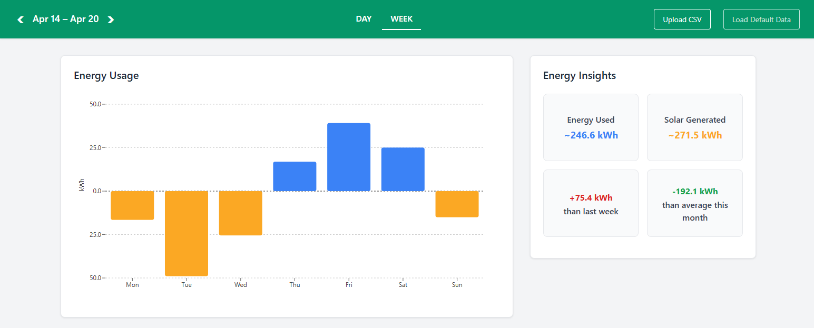

# ⚡ My Energy Story

A clean React dashboard that helps users understand their electricity usage and solar generation, based on **15-minute smart meter interval data**.

Instead of staring at rows of CSV data, customers get an **interactive, performant, visual story** of when and how they use energy — with insights that would be of particular helpfulness to energy users.

🌐 **Live Demo** → [gpsugy-my-energy-story.vercel.app](https://gpsugy-my-energy-story.vercel.app)

---

## 📸 Screenshots

### Daily View


### Weekly View



---

## ✨ Features

### 📊 Charts

**Daily View**

- Hour-by-hour breakdown of energy use and solar generation
- Spot usage spikes (mornings, evenings, etc.)

**Weekly View**

- Day-by-day breakdown across a week
- Compare weekdays vs. weekends at a glance

Both views show **consumption (blue) vs. solar generation (orange)** clearly to emphasize differences

---

### 💡 Insights Panel

Key helpful metrics are summarized:

- **Total Energy Used** – today or this week
- **Solar Generated** – today or this week
- **Comparison to yesterday / last week**
  - _e.g._ “+7.4 kWh than yesterday”
- **Comparison to your average**
  - _e.g._ “3.1 kWh than average this month”

Color-coded deltas make it clear whether usage went up (**🔴 red**) or down (**🟢 green**).

---

### 📂 CSV Upload

- Upload your own 15-min smart meter CSV file
- Or explore with provided examples:
  - `low-winter-interval-data.csv`
  - `high-winter-interval-data.csv`
  - `solar-interval-data.csv` (with solar generation)

---

## 🖼️ Why It Matters

Most customers only see their usage as a single number: **the bill**.  
This dashboard breaks it down into:

- **When** they use energy
- **How much** they use or generate
- **Compared to what** (yesterday, last week, typical average)

… so they can actually understand and adjust their usage.

---

## 🚀 Getting Started

### Prerequisites

- Node.js **16+**
- npm or yarn

### Installation

```bash
git clone https://github.com/gpsugy/my-energy-story.git
cd my-energy-story
npm install
```

### Run locally

```bash
npm run dev
```

Then open http://localhost:5173.

## 🛠️ Tech Stack

⚛️ React (Vite) – fast, modern setup

📊 Recharts – interactive daily/weekly charts

📂 PapaParse – parses 15-minute CSV interval data

🎨 Bootstrap 5 – responsive layout and styling

⏱ date-fns – time interval parsing/formatting

🌐 Vercel – one-click deploy & hosting

## 📄 License

[MIT](./LICENSE)
